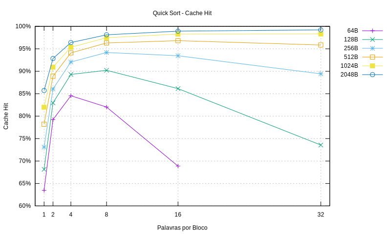
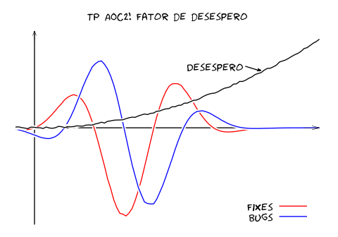

# AOCII Trabalho Prático - 2019.1

## Simulador de Cache

[](https://www.codefactor.io/repository/github/durfan/ufsj-aoc2-tp1)



* Mapeamento direto: folder 'direto'
* Associativo por conjunto: folder 'associativa'

Execução:

Para a Cache mapeada diretamente:

```bash
make
./simcache
gnuplot plot.gp
```

Para a Cache Associavita:

```bash
make
./simcache -v [1,2,4,8] -p [lru,lfu,fifo]
gnuplot plot.gp
```
Obs.: Para a Cache totalmente associativa, setar o número de vias em 1. 

## Changelog


